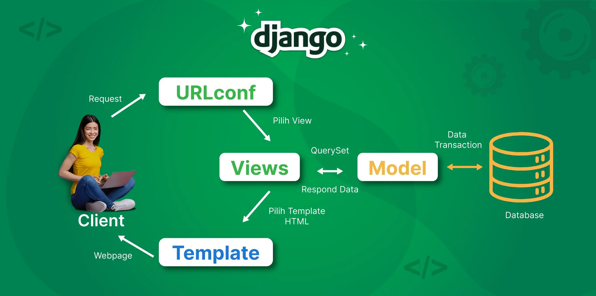

"# sp-sportswear" 

Dalam pembuatan project ini, saya memulai dari membuat project Django terlebih dahulu. Hal ini sudah pernah diterapakan sebelumnya saat melakukan tutorial, diawali dengan melakukan instalasi git dan membuat direktori baru yang nantinya akan kita gunakan untuk menambahkan project kita ke dalam github. Setelah menambahkan project tersebut ke dalam direktori yang sudah kita hubungkan dengan github menggunakan git remote add (link git), saya melakukan commit dan push agar project tersebut dapat ditambahkan ke Github. Setelah berhasil dihubungkan, saya lanjut melakukan instalasi django, dengan membuat requirements seperti yang disarankan pada tutorial 0, isi requirements tersebut berisi hal-hal yang diperlukan untuk melakukan instalasi django. Untuk instalasinya sendiri tidak terlalu rumit dan hanya memerlukan waktu sementara. Setelah itu, jalankan django-admin startproject (namaFilenya) . untuk membuat project django.

Setelah melakukan instalasi django, saya membuat file .env. 
env berupa environment variables yang disimpan di luar kode program, dan ini digunakan untuk menyimpan informasi konfigurasi seperti crendetial database, API Keys, atau pengaturan environment. Hal ini dapat memungkinkan kode yang sama dapat berjalan di environment berbeda tanpa perlu mengubah kode kita. (disini kita juga buat .env.prod dengan production = true, aplikasi akan menggunakan database PostGre SQL) 
disini, tidak boleh lupa untuk mengubah settings.py agar bisa load env dari .env filenya.

Step ke-3 yang saya lakukan setelah berhasil menambahkan project ke dalam git dan set-up selesai, saya hubungkan dengan PWS dengan tata-cara yang sebelumnya diberikan pada tutorial 0 (menambahkan ALLOWED_HOST). Tujuan ini adalah agar kita bisa menggunakan PWS tersebut sebagai host (kita dapat view project kita). 

Setelah saya selesai melakukan set-up baik itu menghubungkan dengan PWS dan Github. Saya baru mulai membuat aplikasi dengan nama main pada proyek saya dengan nama toko SP Sportswear. Tentunya disini kita ingin membuat aplikasi berbeda dengan football-news yang sebelumnya pernah dibuat pada tutorial 1. Karena aplikasi ini berupa aplikasi mengenai sportswear/bola, kita akan mengubah model-model (mengubah nama class menjadi product karena akan menjual barang dan bukan berita) sebelumnya yang berhubungan dengan football news menjadi pakaian-pakaian olahraga yang dapat diinginkan pengguna. Sebelum mengubah model, saya mengaktifkan env terlebih dahulu agar dapat memungkinkan kode yang sama dapat berjalan di env berbeda. Kategori yang saya gunakan disini ada,  jersey, sweater, baju, celana, sepatu, tas, sleeve, kaos kaki, lainnya(apabila tidak ada kategori). Lalu, saya menambahkan nama sebagai nama item, harga/price sebagai harga item, description untuk deskripsi item, thumbnail untuk gambar item, kategori untuk membagi-bagi kategori item, terakhir is_featured untuk menampilkan barang-barang unggulan sportswear yang ada.

Ada beberapa alasan untuk penggunaan tipe data tertentu, misalnya:
nama, category => CharField => tipe data yang ideal untuk menyimpan teks pendek
deskripsi => TextField => tipe data yang ideal untuk menyimpan teks panjang
price => IntegerField => tipe data yang ideal untuk menyimpan angka (bulat)
thumbnail => URLField => tipe data khusus untuk menyimpan url, disini untuk gambar.
is_featured => BooleanField => tipe data yang paling efisien untuk mewakili kondisi biner

Setelah selesai membuat model, saya lanjut membuat HTML template yaitu main.html. Halaman ini berisi konten dasar untuk Tugas 1, termasuk teks "Main" serta nama dan kelas saya. Tujuannya adalah untuk menampilkan halaman ini melalui routing.
Untuk melakukan routing, saya menggunakan file urls.py dan views.py. Di sini, urls.py bertugas menentukan jalur URL, sementara views.py bertanggung jawab untuk memproses permintaan dan mengirimkan respons.

Sebagai contoh, di views.py, saya mendefinisikan sebuah fungsi yang akan merender main.html. Dalam fungsi tersebut, saya melewatkan data dinamis, seperti nama saya, ke dalam template. Teks "{{ name }}" yang ada di main.html kemudian akan diganti secara otomatis menjadi nama saya, yaitu "Matthew Nathanael", saat halaman dirender. Perubahan ini tidak akan terlihat jika main.html dibuka langsung, karena proses penggantian data tersebut hanya terjadi saat halaman diakses melalui routing yang diatur oleh urls.py dan views.py di dalam proyek. Tentunya hal tersebut hanya bisa dilakukan apabila konfigurasi routing url sudah dilakukan (mengubah urls.py pada direktori main dan url.py pada direktori sp-sportswear dan disambungkan pada main.urls)

Setelah proses routing sudah selesai, saya melakukan deployment pada PWS yang sebelumnya sudah saya hubungkan, project tersebut akan saya tambahkan dengan menggunakan
git add . 
git commit -m "Second Commit: Tugas 2 Individu - Finishing" (jika sudah tidak ada perubahan)
git push origin master
git push pws master 
Dengan melakukan step-step berikut, saya sudah berhasil membuat aplikasi main.

 reference: https://www.biznetgio.com/news/django
Pada bagan tersebut kita dapat melihat alur dari request client ke web,
di mana client disini akan melakukan request atau membuat permintaan yang nantinya akan diterima oleh URL, yang kemudian akan diarahkan ke views yang sesuai. Lalu, views akan berinteraksi dengan model untuk mengelola data di database, dan memilih template untuk menghasilkan halaman web yang dikirimkan kembali sebagai respons ke client.
Untuk fungsi dari masing-masing komponen:
Client -> sebagai pengguna (yang melakukan request ke server web)
URL -> melakukan checking yang diminta ke fungsi yang tepat didalam views (url akan mencari kecocokkan)
Views -> berinteraksi dengan model(mengambil data dari database) dan memilih template yang digunakan untuk menampilkan respons kepada clientnya
Model  -> struktur data aplikasinya, biasa mewakili tabel (digunakan untuk membaca/menulis oleh views)
Template -> file html, disini contohnya seperti main.html yang dibuat, berisi markup statis, dapat menampilkan data dinamis yang dikirimkan oleh Views (seperti yang ada pada main.html {{ class }} )

Selama proses pembuatan aplikasi tersebut, settings.py berperan penting dalam konfigurasi proyek Django. Dengan memodifikasi settings.py kita dapat menambahkan allowed_host, menggunakan env, mendefinisi detail ke database, dapat mencantumkan semua aplikasi (digunakan django untuk mengetahui model, template) jadi untuk mengubah perilaku proyek django memang perlu melakukan modifikasi pada settings.py

Migrasi database di Django adalah cara untuk memperbarui skema database agar sesuai dengan perubahan pada model Django. Proses ini terdiri dari membuat migrasi dan menerapkan migrasi

manage.py makemigrations -> memindahkan models.py, membuat file migration baru di directory migration -> gunanya agar dapat mengetahui perubahan pada model (belum diapply ke database)
manage.py migrate ->  django akan membaca file dan eksekusi SQL (membuat kolom baru pada table), mengaplikasikan perubahan model yang tercantum dalam berkas migrasi ke basis data

Django sering direkomendasikan sebagai framework permulaan untuk pengembangan, terutama untuk orang-orang yang ingin fokus ke web-developing.
Django menyediakan semua yang developer butuhkan untuk membangun suatu aplikasi web. Ketika menggunakan framework Django, tidak memerlukan untuk download-download atau install banyak hal untuk fungsi dasar, sangat mudah untuk digunakan. Django sudah memiliki fitur-fitur bawaan yang membuat pengguna/pengembang web tidak perlu kesusahan menginstall dari tempat lain. Selain itu, dari segi security/keamanan, Django sudah memiliki keamanan yang sangat kuat berbeda dengan PHP, secara bawaan framework ini sudah bisa melindungi dari beberapa serangan umum sperti SQLi, XSS dan lain-lain.
Selain itu, Django juga menerapkan pola desain MTV, yang dimana sangat mirip dengan MVC, struktur ini memisahkan logika aplikasi dengan rapi. Tentunya hal ini akan sangat baik bagi pemula agar bisa membangun kebiasaaan koding yang baik (separation of concerns)

# Feedback 
Untuk tutorial 1, menurut saya sudah lumayan cukup mudah untuk di mengerti, karena secara online mungkin beberapa masih ada yang kesusahan, tetapi sudah sangat membantu dengan penjelasan-penjelasan yang diberikan.
 

# Tugas 3
1. Kita memerlukan data delivery dalam pengimplementasian sebuah platform, untuk memenuhi requirement platform untuk menunjukkan atau mengirimkan data yang diperlukan, kita perlu mengirimkan data dari satu stack ke stack lainnya -> diperlukan untuk memastikan berbagai bagian dari sebuah sistem dapat berkomunikasi. Contoh-contohnya untuk melakukan data delivery bisa dengan format html, json, dan xml. Dengan json yang paling sering digunakan. Mereka adalah bahasa universal untuk data untuk memastikan data yang kita kirim bisa dipahami. Sedangkan HTML sendiri bertanggung jawab untuk mengambil data dan mengubah menjadi sesuatu yang dapat kita lihat. 
2. Format data delivery yang lebih baik adalah JSON, salah satu alasan kenapa JSON bisa lebih populer dan lebih baik dari XML adalah, karena client/frontend pada umumnya sekarang menggunakan javascript sebagai bahasa pemrograman dan compiler, sehingga penggunaan JSON dengan basisnya merupakan tipe data javascript menjadi lebih masuk dan lebih terkenal. Selain itu, JSON juga menggunakan sintaks yang jauh lebih sederhana dibanding XML. Di mana XML memerlukan tag pembuka dan penutup untuk setiap element data (file jadi besar) sedangkan json menggunakan format key: value (jadi lebih mudah dipahami)
3. Fungsi dari method is_valid pada views.py (pada function create_product) pada form Django berguna untuk melakukan checking pada data, apakah data yang dikirim melalui form tersebut sudah valid? fungsi is_valid() sendiri adalah metode bawaan yang sangat penting. Karena berguna untuk melakukan validasi secara automated (misal, kalau data tidak sesuai format akan di keep out untuk tidak masuk data base). is_valid juga dapat meningkatkan keamanan dan membuat koding lebih efisien karena tidak perlu menulis validasi secara manual.
4. csrf_token diperlukan saat membuat form Django karena csrf_token adalah token yang berfungsi sebagai security. Token ini sendiri di-generate secara otomatis oleh Django untuk mencegah serangan berbahaya. Pada case project ini, kita menggunakan CSRF Trusted Origins yang berguna untuk memberikan akses/kepercayaan ke url yang dideploy(note: harus protokol, dengan menggunakan https) Jika, csrf_token tidak ditambahkan, maka aplikasi akan rentan terhadap CSRF(Cross-Site Request Forgery) -> penyerang memaksa pengguna yang ter-authenticated untuk mengirimkan permintaan http ke server web yang rentan (tanpa diketahui penggunanya sendiri)
Bagaimana cara hacker bisa memanfaatkan? seperti mengubah password, mengirim uang ke rekening lain yang tidak dikenal, hapus data, yang tentunya akan sangat merepotkan.
Cara-cara orang bisa terkena CSRF, seperti:
-hacker akan mengirim link ke situs palsu, pengguna mengklik link tersebut (phising), di situs palsu terdapat html tersembunyi yang mengirim form ke site Django, karena targetnya sudah login, cookie sesi valid mereka akan dikirim bersamaan dengan permintaan form palsu. Di sini, server Django akan menerima saja permintaan tersebut karena tidak adanya token CSRF untuk di verif. Lalu, momen tersebut akan dimanfaatkan untuk hal-hal yang tidak benar.
5. Pada tugas kali ini, kita ingin mempelajari apa itu form dan kegunaan data delivery sendiri dengan menggunakan xml, json. Pada tutorial sebelumnya saya sudah mempelajari cara membuat form input data yang menampilkan data aplikasi pada html dan juga belajar cara mengembalikan data dalam bentuk baik xml dan json. 
- Step pertama yang saya lakukan ada melakukan activation pada virtual environment, setelah itu saya baru mulai mengimplementasikan skeleton (base.html) sebagai kerangka views
- Mengisi DIRS dengan BASE_DIR / 'templates' sebagai path yang menghubungakan dengan project. Lalu APP_DIRS dijadikan true, hal ini dilakukan agar templates milik app diprioritaskan daripada base_site.html.
- Menggunakan base.html sebagai template utama, untuk melakukan hal tersebut menambahkan



pada main.html
- membuat forms.py untuk membuat struktur form yang dapat menerima data Product baru (yang nantinya dapat ditampilkan ada halaman utama)
- mengubah views.py dan menambahkan fungsi-fungsi untuk create_product (menggunakan is_valid yang sebelumnya dijelaskan) dan show_product, serta menambahkan import baru.
- mengubah main.html, update code dan menambahkan tombol Add Product, disertai thumbnails dan description product. Selain itu, pada templates juga menambahkan create_product dan product_detail. Create product untuk menambah produk-produk yang ingin ditambahkan sedangkan product_detail berfungsi ketika pengguna klik produk tersebut, yang dimana ketika diklik, pnegguna dapat melihat apa kategori produk tersebut, harganya, rating, dan juga deskripsi full dari produk tersebut.
- Setelah itu, saya menambahkan beberapa function yang berguna untuk mengembalikan data dalam xml dan json yang saya pelajari dari tutorial yang sebelumnya diberikan. Untuk melakukan hal tersebut, kita perlu membuka views.py dan menambahkan beberapa import dari django.
ada serializers(untuk translate objek model menjadi format XML dan json) dan httpresponse(parameter data query yang sudah diserialize, di mana akan direturn pada function oyang dibuat pada views.py)
- Melakukan edit pada urls.py untuk menambahkan import dari function yang sudah dibuat dan menambahkan path, step yang dilakukan sama baik json ataupun xml dengan cara menambahkan:
from main.views import show_main, create_news, show_news, show_xml
path('xml/', show_xml, name='show_xml') pada urls.py
Tentu, hal ini juga berlaku apabila ingin menambahkan show_xml_by_id dan show_json_by_id (cara penambahan pada urls.py sama). Untuk show_xml_by_id dan show_json_by_id memiliki konsep yang sama dengan show_xml atau show_json, hanya ditambahkan parameter id yang berupa input dari user. Jadi, kita bisa dengan bebas mengakses product dengan id yang kita inginkan.
- Setelah selesai, saya melakukan checking dengan membuka localhost dari produk yang sudah saya tambahkan. Lalu, saya menggunakan postman untuk melihat hasil dari seluruh step yang sudah dilakukan.
- Setelah melakukan checking, saya melakukan deaktivasi virtual environment dan melakukan commit pada github dan pws.
6. Feedback tidak ada, menurut saya asistensi untuk tutorial sudah baik dan lumayan bisa di mengerti. 

# Tugas 4
1. Dalam Django, authentication berguna untuk melakukan checking terhadap user yang sedang log-in, secara sederhana, authentication akan memberikan akses hanya kepada user yang memiliki akses kepada akun tersebut. Jadi, AuthenticationForm adalah form yang berasal dari django dan digunakan untuk proses login user. Pada proses login akan menyediakan field input yang berasal dari user untuk disamakan (username & password), lalu nantinya akan dilakukan proses autentikasi dengan cara menggunakan authenticate(), proses authentication sendiri sangat efektif karena dapat melakukan otomasi checking terhadap user. Walaupun, beberapa hal harus diubah jika ingin menambahkan authentication lain.

2. Authentication dan Authorization memiliki perbedaan, di mana orang yang memiliki terautentikasi belum tentu memiliki autorisasi terhadap akses tertentu.   
Autentikasi -> memastikan user yang melakukan login
Otorisasi -> akses-akses yang hanya diberikan kepada user tertentu
Contoh autentikasi dapat kita lihat ketika proses login dengan fitur django menggunakan authenticationform (memastikan user yang login memiliki password yang benar)
sedangkan authorization, hanya memberikan akses misal kepada orang yang sudah login, jadi kalau belum login tidak bisa mengakses halaman utama (penggunaan login_required pada show_main)

3. Kelebihan dari cookies adalah cepat diakses, dapat digunakan untuk menyimpan preference user, terhadap size font, dll, dan tidak memerlukan server tambahan, Lalu jika data disimpan dalam cookies, aplikasi web dapat mengakses ssecara offline, dan juga dapat melacak pengguna di berbagai situs web.
Namun, kekurangan cookies yaitu, dari segi keamanan, seringkali ada kasus dimana cookies tidak aman karena data tidak dienkripsi(penting), pengguna juga bisa menonaktifkan cookies sehingga fungsi cookies sendiri tidak berlaku. Selain itu, cookies juga tidak efektif untuk menyimpan data kompleks, dan hanya digunakan untuk data sederhana. Cookies juga sangat rentan untuk terkena serangan Cross-Site Scripting dan CSRF (Cross Site Request Forgery)

Session, serbeda dengan cookies, session adalah cara untuk menyimpan informasi tentang pengguna di sisi server. Session digunakan untuk melacak state pengguna atau user. Di mana ID session ini akan digunakan untuk identifikasi pengguna dan disimpan ke dalam cookies, ID tersebut dapat digunakan untuk mengambil data session dari server

Kelebihan session, memiliki keamanan yang lebih dibandingkan cookies karena datanya di simpan di sisi server, web developer juga bisa menghapus data session kapan saja. Lalu, dari segi penggunaannya sendiri session API lebih gampang digunakan dan diintegrasikan ke web. (session tidak memiliki limit ukuran)

Kekurangan session, seperti beban server terlalu banyak jika terlalu banyak user, jika server mati maka data session hilang, session sulit untuk diskalakan 

4. Penggunaan cookies secara default dalam pengembangan web, tergolong tidak aman karena dapat membawa resiko seperti CSRF, pencurian cookies dan potensi-potensi buruk lainnya, ada risk yang harus diwaspadai, sehingga penggunaan cookies secara default penuh dengan risiko. Untungnya, Django dapat melakukan solving pada problem tersebut dengan menggunakan,
- CSRF_TOKEN, Django menyediakan token CSRF yang harus disertakan dalam setiap formulir POST. Token ini memastikan bahwa permintaan berasal dari pengguna yang valid, bukan dari serangan luar. Token ini disandingkan dengan cookie CSRF yang unik per sesi.
- Django secara default mengatur flag HttpOnly pada cookie sesi. Ini berarti cookie tersebut tidak dapat diakses atau dimanipulasi oleh skrip sisi klien (seperti JavaScript). Dengan demikian, risiko pencurian cookie melalui serangan Cross-Site Scripting (XSS) berkurang secara signifikan.
- Django dapat dikonfigurasi untuk hanya mengirimkan cookie melalui koneksi yang aman (HTTPS) dengan mengaktifkan pengaturan SESSION_COOKIE_SECURE dan CSRF_COOKIE_SECURE. Hal ini mencegah cookie dicegat oleh pihak ketiga saat transmisi.

5. Pada pengerjaan Tugas 4 kali ini ada beberapa hal yang ditambahkan, pada tugas ini berfokus kepada membuat fungsi, form registrasi (login, authentication, authorization), menghubungkan data dari cookies, menghubungkan user dengan model.
 - Menambahkan fungsi pada views (menambahkan import UserCreationForm dan messages untuk memudahkan pendaftaran), yaitu fungsi register, dengan menggunakan form dapat melakukan otomasi dan menghasilkan akun pengguna ketika data di submit dari form dengan menggunakan form.is_valid() dari yang dipelajari pada Tugas 3 / Tutorial 2 sebelumnya. (menggunakan request.method == "POST")
- Membuat HTML baru dengan register.html dan juga menambahkan pada URL (import register)
- Pada views.py, menambahkan import authenticate, kegunaannya adalah untuk melakukan checking apakah login info sudah sesuai atau belum, hal ini akan digunakan untuk login_user. Setelah membuat fungsi register, saya membuat fungsi login_user. Disini untuk melakukan authentication, melakukan import AuthenticationForm dan import authenticate, login.
- Membuat fungsi login dengan menggunakan AuthenticationForm dari Django, karena dengan menggunakan authentication, kita tidak perlu secara manual merubah code, dan bisa melakukan otomasi authentication ketika login (misalnya harus minimal berapa karakter ataupun apakah password sudah sesuai, apakah ada user tersebut), dan if request.method == 'POST' digunakan untuk memeriksa apakah pengguna mengirimkan permintaan login melalui halaman login. Jika ya, form harus divalidasi terlebih dahulu sebelum melakukan login ke sistem Django.
- Buat berkas login.html sama seperti step register sebelumnya, dan tambah pada urls.py (import dan add path)
- Menambahkan import logout bersama dengan login dan authenticate, lalu buat fungsi logout_user dalam views.py serta menambahkan logout button dibawah add product pada main.html, lalu import function tersebut pada urls.py dan add path.
- Pada views.py menambahkan login_required, hal ini berguna sebagai otorisasi dimana, untuk mengakses main page perlu login terlebih dahulu, login_required ini akan ditambahkan pada fungsi show_main dan show_products (hanya orang yang memiliki akses dapat mengakses main page)
- Lalu, pada views.py menambahkan import HttpResponseRedirect, reserve, dan datetime, kegunaannya disini untuk menambahkan fitur last login dengan cara menggunakan data dari cookies, jadi kita dapat menambahkan response.set_cookie untuk mendaftarkan last_login di response, selain itu HttpResponseRedirect disini juga bekerja untuk redirect ke main page sehabis response diterima. Apabila sudah, tambahkan last_login pada html dengan menggunakan request.COOKIES.get('last_login', 'Never') pada context. Setelah itu, sesuaikan fungsi logout_user sebelumnya untuk menghapus cookie setelah logout (tambahkan response.delete_cookie('main:login'))
- Menambahkan sesi terakhir login pada main.html
- Selanjutnya, saya mencoba menghubungkan model product dengan user, dimana setiap user nanti akan bisa menambahkan produk masing-masing (dimana nanti pada setiap produk akan terlihat seller atau penjualnya). Hal ini dapat dilakukan dengan menambahkan from django.contrib.auth.models import User pada models.py dan pada model Product menambahkan user dengan models.ForeignKey
- Menambahkan perubahan pada fungsi create_product dengan menambahkan commit=False agar django tidak langsung menyimpan objek hasil form ke database, lalu mengisi field user dengan request.user, dengan ini setiap produk yang dibuat nanti akan langsung terhubung ke pembuatnya (user), jika sudah, kita bisa menambahkan filter_type pada show_main agar bisa melakukan filtering antara produk yang dibuat user sendiri atau seluruh pengguna. Jika sudah ditambah, dapat menambahkan button filter tersebut pada main.html.
- Melakukan commit dan push pada github dan pws
# Tugas 5
1.Dalam pengembangan web, ketika beberapa aturan CSS mencoba mengatur properti yang sama pada satu elemen HTML, browser menentukan aturan mana yang akan diterapkan berdasarkan urutan prioritas (specificity) selector. Prioritas tertinggi diberikan pada Inline Styles (CSS yang ditulis langsung di atribut style pada tag HTML). Di bawahnya, prioritas dihitung berdasarkan jumlah dan jenis selector: ID Selectors memiliki bobot tertinggi, diikuti oleh Class, Attribute, dan Pseudo-Class Selectors (seperti :hover), dan yang terakhir adalah Element dan Pseudo-Element Selectors (seperti p atau div). Selector yang memiliki nilai prioritas gabungan tertinggi akan selalu menang.

2. Mengapa Responsive Design Penting?
Responsive design merupakan konsep yang sangat penting karena mayoritas akses internet saat ini menggunakan handphone. Tujuan utamanya adalah memastikan pengalaman pengguna (UX) yang optimal dengan menyesuaikan layout dan elemen visual secara automated berdasarkan ukuran layar devicenya, menghilangkan kebutuhan user untuk zoom atau scroll horizontal. Aplikasi yang sudah responsif, seperti Tokopedia atau Instagram Web, menampilkan navigasi yang ringkas (hamburger menu) dan konten yang tersusun dalam satu kolom saat diakses dari smartphone, sehingga mudah dibaca dan dioperasikan. Sebaliknya, aplikasi yang belum responsif (misalnya, situs web korporat kuno yang dibangun dengan lebar tetap) akan menampilkan versi desktop yang diperkecil pada handphone, memaksa pengguna untuk memperbesar dan scroll ke samping, yang membuat aplikasi tersebut sulit digunakan.
3. Perbedaan antara margin, border, dan padding dijelaskan melalui konsep CSS Box Model, di mana setiap elemen dianggap sebagai kotak berlapis. Content adalah area inti, tempat konten berada. Padding adalah ruang di dalam kotak, berfungsi sebagai jarak antara konten dan border. Margin adalah ruang di luar kotak, berfungsi sebagai jarak antar elemen. Ketiganya diimplementasikan melalui properti CSS, misalnya: padding: 10px; untuk memberikan ruang 10 pixel di dalam border, border: 2px solid black; untuk membuat garis tepi hitam setebal 2 pixel, dan margin: 20px; untuk memberikan jarak 20 piksel ke elemen di sekitarnya.
4. Flexbox (Flexible Box Layout) dan Grid Layout (CSS Grid) adalah dua sistem layout utama yang digunakan dalam desain web modern. Flexbox adalah sistem satu dimensi, yang berarti ia fokus mengatur elemen (item) hanya dalam satu sumbu (baik horizontal sebagai baris atau vertikal sebagai kolom). Kegunaannya ideal untuk menata item-item dalam satu komponen, seperti bilah navigasi atau baris kartu produk. Grid Layout, sebaliknya, adalah sistem dua dimensi yang memungkinkan kita dalam mendefinisikan dan mengatur elemen dalam baris dan kolom secara bersamaan. Grid sangat berguna untuk membuat struktur tata letak halaman yang kompleks (page layout), seperti menempatkan header, sidebar, dan area konten utama dengan presisi tinggi. Keduanya sering digunakan bersamaan.
Grid untuk layout makro halaman, 
dan Flexbox untuk layout mikro komponen di dalamnya.